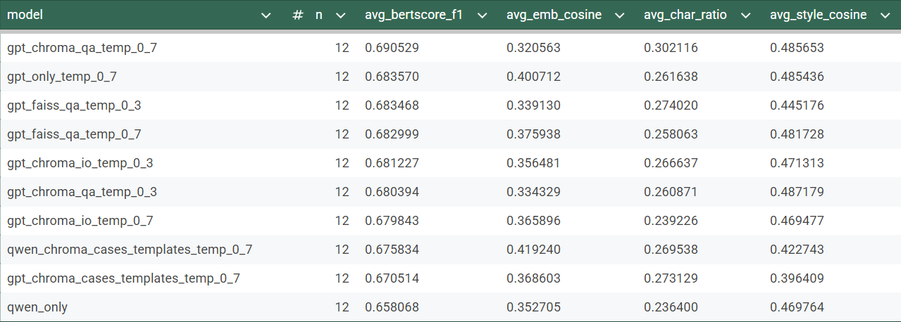

# Результат исследования:

# Общая схема пайплайна

1. Скачать аудио с YouTube (опционально): `download_audio.py`.
2. Получить текстовые транскрипты .txt с помощью сторонних сервисов.
3. Очистить транскрипты и привести к JSONL: `clean.py`.
4. Из cleaned JSONL нужно сделать chunking:
  - chunks для RAG: `chunk.py`.
  - cases для шаблонного подхода: `chunk_cases.py`.
5. Индексация:
   - chunks для ChromaDB: `index_chroma.py`;  или для FAISS: `index_faiss.py`.
   - cases для ChromaDB: `index_chroma_cases.py`; или для FAISS: `index_faiss_cases.py`.

---

# Запуск скриптов

## 1) Скачивание аудио (mp3) из YouTube через yt-dlp (Windows)

Скрипт `download_audio.py` берёт список YouTube-ссылок из `urls.txt` и с помощью `yt-dlp` извлекает аудио в формате `mp3` в указанную папку.

### 1) Установки

- Python 3.10+ 
- yt-dlp (скачать .exe)
  - Скачать yt-dlp.exe с официальной страницы релизов yt-dlp. 
  - Положить yt-dlp.exe в любую папку. 
- FFmpeg - yt-dlp использует FFmpeg для извлечения аудио и конвертации в mp3. 
  - Скачать и распаковать FFmpeg (Windows build). 
  - Добавить папку C:\ffmpeg\bin в системную переменную окружения PATH

### 2) Подготовка входных данных
- Создать папку для аудио
- Создать файл urls.txt 
  - Формат: одна ссылка на строку; пустые строки игнорируются; строки, начинающиеся с #, игнорируются. 
    - Пример urls.txt:
      https://www.youtube.com/watchlink
      https://www.youtube.com/watchlink2
      https://youtu.be/watchlink3

### 3) Запуск
Нужно перейти в папку, где лежит download_audio.py, и запустить:

python download_audio.py --yt-dlp "path\to\yt-dlp.exe" --urls "path\to\urls.txt" ^ --out  "path\to\out_dir"

### 4) Выходные файлы
Файлы сохраняются с шаблоном:
%(id)s_%(title)s.mp3

---

## 2) Очистка транскриптов и приведение к JSONL

Скрипт `clean.py` читает сырые расшифровки интервью в формате .txt, чистит их от “мусора” (ремарки в скобках, джинглы/музыка, рекламные строки), выделяет реплики по спикерам и склеивает подряд идущие строки одного спикера в один блок. Результат сохраняется в формате JSONL: одна строка = один блок спикера.

### 1) Установки

- Python 3.10+ 

### 2) Подготовка входных данных

- Создать папку с транскриптами
- Формат файлов: .txt
- Требования к формату транскрипта:
  - Реплики должны иметь маркер говорящего в одном из форматов: [СПИКЕР], СПИКЕР: текст, СПИКЕР: (текст на след. строке)

### 3) Запуск

Нужно перейти в папку, где лежит файл, и запустить:

python clean.py "path\to\input_dir" "path\to\out_dir"
- input_dir - корневая папка с .txt 
- out_dir - папка, куда будут записаны .jsonl

### 4) Выходные файлы

Для каждого входного .txt создаётся отдельный файл, где:

- Имя: <interview_id>.jsonl, где interview_id = имя_файла
- На каждой строке: interview_id - ID из имени файла, source_file - имя файла, replica_id - номер реплики, speaker - нормализованная роль (interviewer или guest), speaker_raw - оригинальная метка спикера (для отладки ошибок), text - очищенный и склеенный текст реплики.

---
